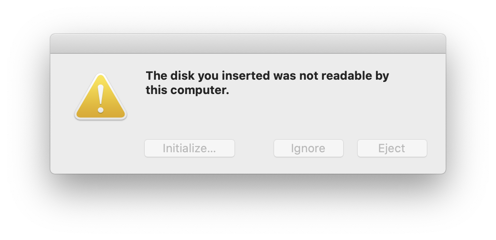

# drive-flasher

**drive-flasher** is a cli to flash an OS on a removable drive. It is designed to be simple to use on your mac.

## Installation

> You may need to use `sudo` to install the package globally. This CLI will only work on _macOS_.

```bash
$ npm i -g drive-flasher
```

After installing the cli, you are ready to use it.

## Usage

> The cli has only been tested on _macOS Catalina_ with an _Ubuntu_ ISO image.

1. Insert your drive
2. If the following alert pops up just after inserting the drive, press on "**Initialize...**" : 
3. Run the following command in the Terminal (`sudo` is needed to do the flashing):

   > Note that it will also wipe everything on the drive.

   ```bash
   $ sudo drive-flasher
   ```

4. Respond to the questions asked...
5. Let it do its work, go get a cup of coffee!
6. This alert will pop up when the flashing is done. Press on "**Ignore**" :
7. Remove the drive and use it!

## Author

- **Vu Dang Khoa Chiem** - Doudou8

## License

This project is licensed under the MIT License - see the [LICENSE](LICENSE) file for details
